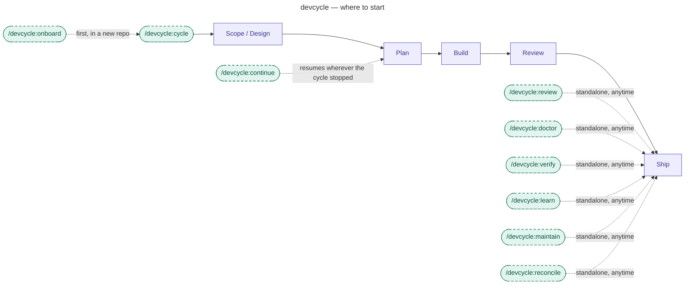

# devcycle

A Claude Code plugin that turns a one-line feature, bug, or refactor description into a
verified, reviewed implementation on its own git branch. You type one command; devcycle asks
clarifying questions to scope and brainstorm the work, designs a spec with you, plans it as
parallel tasks, and implements them test-first with subagents running in parallel. It reviews
the finished branch against the spec and — when the change is visible on screen — drives the
running app through claude-in-chrome to auto-check every item a browser can confirm
structurally, then walks you through the rest, since how it actually looks and feels is your
verdict, not a script's.

Beyond building the change, devcycle closes the loop around a pull request: it reads a PR's
review comments and reconciles them into the right fixes and consented replies. And it
benchmarks its own runs and learns from past sessions — so the pipeline gets better the more
you use it.

Policy — what it may do with git, which models it runs, how deep reviews go — is
configuration, not something you re-explain each session, and a single `profile` preset sets
the cost-versus-rigor level for all of it at once. devcycle is built entirely on the
[superpowers] plugin (a required dependency): superpowers is the toolkit, devcycle is the
guide for using it as a repeatable pipeline. Brainstorming and debugging are upstream's,
unmodified; devcycle adds the stages, gates, and mechanics around them, and ships compact
native planning and execution engines that overlay their upstream counterparts only at the
`thorough` profile.

## Where to start


Command-level only — for stage internals, see `docs/pipeline/`.

Those nine commands are devcycle's entire surface — everything else it ships is machinery they
load. The full stage-level pipeline is in [`docs/pipeline/`](docs/pipeline/README.md).

Two of the standalone commands form a review write-back path around a pull request:
`/devcycle:review` **produces** a ranked findings document and can **file** those findings back
onto an open PR, and `/devcycle:reconcile` **responds** to a PR's own review comments — triaging
them into fixes and consent-gated replies. Both post through one shared comment-body shape, so
what Claude files and what it replies look the same on the PR.

- [Install](#install)
- [Use](#use)
- [Troubleshooting](#troubleshooting)
- [Go deeper](#go-deeper)

## Install

```
claude plugin marketplace add KonstantinRoehrl/devcycle
claude plugin install devcycle@devcycle
```

devcycle depends on the [superpowers] plugin. Installing devcycle installs it
automatically from the official Claude Code plugin directory; afterwards
`claude plugin list` shows both `devcycle` and `superpowers` as enabled.

Requires a recent Claude Code CLI — verified on 2.1.217 and later.

For the on-device verification stage's automatic checks, also install the claude-in-chrome
plugin — Claude Code's integration with your own Chrome (without it, every checklist item
falls to you).

## Use

Start a cycle with a description of any maturity — a one-liner is fine:

```
/devcycle:cycle add CSV export to the report page
```

What to expect: devcycle first judges how developed your description is (a rough idea starts
with a scope interview; a detailed ticket skips ahead). Questions come in small batches with
concrete options to pick from, never one-at-a-time trickles. You approve the spec, then the
plan; implementation, testing, and review then run without you; at the end you get a branch
(and, for UI work, a short guided walkthrough of what to check on the running app).

The pipeline saves its position to files under `.devcycle/` at every stage boundary, so it
survives `/clear`, compaction, and new sessions — resume any time with `/devcycle:continue`.
How the stages hand off and how the state file is verified is covered in
[`docs/pipeline/`](docs/pipeline/README.md).

The pipeline pauses between stages by design: it stops at most stage boundaries and asks you to
run `/clear` and then `/devcycle:continue`, so a cycle plays out as several short sessions
rather than one long one.

**Add `.devcycle/` to the target repo's `.gitignore`** — none of it belongs in git history.
What devcycle attempts to commit *outside* that directory is `docTrackingPolicy`'s call.

`profile` is the one knob most people need — it sets the cost-versus-rigor level for the whole
run at once. The full configuration surface is in
[`docs/configuration/`](docs/configuration/README.md).

## Troubleshooting

- **devcycle shows "failed to load"** in `claude plugin list` — the [superpowers]
  dependency is missing or disabled. It normally installs automatically from the
  official plugin directory (`claude plugin install superpowers@claude-plugins-official`
  re-resolves it); once present and enabled, both plugins load.
- **Two copies of superpowers listed** — you had superpowers installed from its own
  marketplace before installing devcycle, and the dependency pulled in the official-directory
  copy as well. Both work; keep one, e.g.
  `claude plugin uninstall superpowers@superpowers-marketplace`.
- **A literal `${user_config.KEY}` string appears in output** — that option is simply
  unset; this is expected. What the pipeline uses instead follows the resolution order in
  [`docs/configuration/`](docs/configuration/README.md). Set the option to make the value
  substitute.
- **Source edits don't show up after reinstalling** — the plugin cache is keyed by
  version, and reinstalling the same version does not refresh it. Bump the version or
  uninstall and reinstall.

## Go deeper

[`docs/`](docs/README.md) is the documentation hub — the design, the full pipeline, every
playbook, the configuration surface, the decision log, and the full inventory of what the
plugin ships. Start there.

- Design rationale and architecture: [`docs/design/`](docs/design/README.md)
- Decision log: [`docs/decisions/`](docs/decisions/README.md)
- How the coordinator delegates and keeps its own context small:
  [`references/delegation.md`](references/delegation.md)
- Open defects: [`docs/known-issues.md`](docs/known-issues.md)
- Release history: [`CHANGELOG.md`](CHANGELOG.md)
- Contributing, including the golden-path fixture that holds the pipeline's wiring together:
  [`CONTRIBUTING.md`](CONTRIBUTING.md). `scripts/doctor.mjs` re-measures devcycle's own token
  profile from a local Claude Code session corpus, which is how the cost claims are kept honest
  rather than assumed; it reads each run's workload from records the `hooks/workload-sensor.mjs`
  commit-sensor writes on every commit, not from a single finish-stage step.

[superpowers]: https://github.com/obra/superpowers
