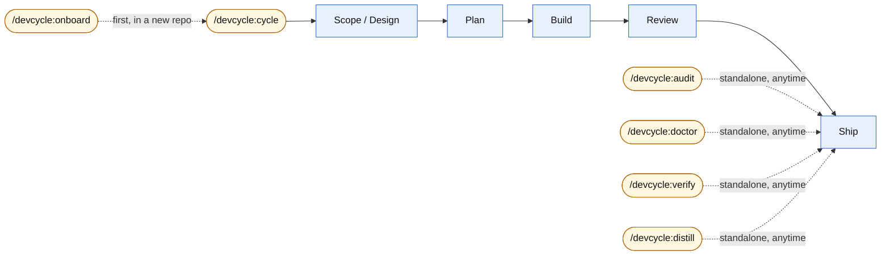

# devcycle

A Claude Code plugin that turns a one-line feature, bug, or refactor description into a
verified, reviewed implementation on its own git branch. You type one command; devcycle
interviews you about scope, designs a spec with you, plans the work as parallel tasks,
implements them test-first with subagents, reviews the finished branch against the spec, and —
when changes are visible on screen — walks you through checking them on the running app.

Policy — what it may do with git, which models it runs, how deep reviews go — is
configuration, not something you re-explain each session, and a single `profile` preset sets
the cost-versus-rigor level for all of it at once. It builds on the [superpowers]
plugin (a required dependency) instead of replacing it: brainstorming and debugging are
upstream's, unmodified, and devcycle adds the stages, gates, and mechanics around them.
Planning and execution ship as compact devcycle-native engines that overlay their upstream
counterparts only at the `thorough` profile.

## Where to start



The full pipeline, every stage and every dashed standalone tool, is diagrammed below.

## Install

```
claude plugin marketplace add KonstantinRoehrl/devcycle
claude plugin install devcycle@devcycle
```

devcycle depends on the [superpowers] plugin. Installing devcycle installs it
automatically from the official Claude Code plugin directory; afterwards
`claude plugin list` shows both `devcycle` and `superpowers` as enabled.

Requires a recent Claude Code CLI — verified on 2.1.217 and later.

For the on-device verification stage's automatic checks, also install the claude-in-chrome
plugin — Claude Code's integration with your own Chrome (see below — without it, every
checklist item falls to you).

## Use

Start a cycle with a description of any maturity — a one-liner is fine:

```
/devcycle:cycle add CSV export to the report page
```

What to expect: devcycle first judges how developed your description is (a rough idea starts
with a scope interview; a detailed ticket skips ahead). Questions come in small batches with
concrete options to pick from, never one-at-a-time trickles. You approve the spec, then the
plan; implementation, testing, and review then run without you; at the end you get a branch
(and, for UI work, a short guided walkthrough of what to check on the running app).

The pipeline saves its position to files (`.devcycle/state.md` plus its spec/plan/ledger
artifacts) at every stage boundary, so it survives `/clear`, compaction, and new sessions.
The state file names the repo root and the request it belongs to, and every reader
verifies that binding first — a state file can never be mistaken for another project's.
Resume any time with:

```
/devcycle:continue
```

**Add `.devcycle/` to the target repo's `.gitignore`.** Everything devcycle writes there —
the state file, the ledger, per-task evidence files, sweep reports — is scratch for the run
in progress, not project history. The artifacts worth keeping land outside it: the spec and
plan under `docs/`, an audit under `docs/audits/`, the on-device checklist next to the
feature. Before committing any artifact it writes, devcycle asks `git check-ignore` first
and skips the commit if your repo ignores that path — your ignore rules decide what enters
history, not the plugin.

## The pipeline

```mermaid
flowchart TD
    CYCLE(["/devcycle:cycle request"]):::entry
    CONT(["/devcycle:continue"]):::entry
    AUDITCMD(["/devcycle:audit — optional branch:name"]):::entry
    VERIFYCMD(["/devcycle:verify branch"]):::entry
    DOCTORCMD(["/devcycle:doctor — optional --all"]):::entry
    ONBOARDCMD(["/devcycle:onboard"]):::entry
    DISTILLCMD(["/devcycle:distill"]):::entry

    CYCLE --> STATE["Step 0 · state file<br/>root · branch · request · first-run config"]:::orch
    STATE --> TRIAGE{"Triage<br/>maturity · kind · size"}:::orch
    CONT -. "re-derives position from .devcycle/state.md<br/>and re-enters at any stage below — this is how<br/>a cycle crosses nearly every boundary" .-> TRIAGE

    TRIAGE -->|"rough idea"| SCOPING
    TRIAGE -. "mature input — scoping skipped" .-> BRAINSTORM
    TRIAGE -->|"audit-shaped request"| AUDIT
    TRIAGE -. "trivial, after you confirm" .-> FAST
    TRIAGE -. "bulk mechanical, after two gates" .-> SWEEP

    SCOPING["Scoping<br/>batched interview · dispatched repo research · confirm the picture · hard stop"]:::orch
    SCOPING --> A_SCOPE[/"confirmed scope"/]:::art
    A_SCOPE --> ISBUG{"bug with no known cause?"}:::orch
    ISBUG -->|yes| DIAG
    ISBUG -. "no — diagnosis skipped" .-> BRAINSTORM

    DIAG["Diagnosis<br/>reproduce · isolate · establish the cause"]:::orch
    DIAG --> A_DIAG[/"root-cause report"/]:::art --> BRAINSTORM

    AUDIT["Audit<br/>scope + dispatched discovery · criteria gate with audit plan · sweep · eleven-field findings"]:::orch
    AUDIT --> A_AUDIT[/"ranked findings document"/]:::art
    A_AUDIT -->|"in cycle — you pick findings to act on"| BRAINSTORM
    A_AUDIT -. "in cycle — nothing picked" .-> STOP
    A_AUDIT -. "standalone — the audit stops here, it starts nothing" .-> AUDITSTOP(["findings document delivered"]):::entry
    A_AUDIT -. "each finding you act on starts its own new cycle" .-> CYCLE

    BRAINSTORM["Brainstorm<br/>design dialogue · approaches · spec self-review · your approval"]:::orch
    BRAINSTORM --> A_SPEC[/"approved spec"/]:::art --> PLANNING

    PLANNING["Planning<br/>feasibility gate · dispatched research · task cut · dependencies · dispatch map"]:::orch
    PLANNING -. "NO-GO — blocking unknown" .-> STOP
    PLANNING --> A_PLAN[/"wave plan"/]:::art --> IMPL

    subgraph EXECUTION["Execution — wave by wave"]
        IMPL["implementer<br/>one task brief · test-first"]:::sub
        REVIEW["task-reviewer<br/>produces the diff itself · reads the evidence files"]:::sub
        GATE{"green gate<br/>coordinator re-runs the tests itself"}:::orch
        COMMIT["commit + ledger entry"]:::orch
        CHK["checklist generated<br/>the moment rendered changes land"]:::orch
        IMPL --> REVIEW
        REVIEW -->|rejected| IMPL
        REVIEW -->|accepted| GATE
        GATE -->|fails| IMPL
        GATE -->|passes| COMMIT
        IMPL -. "rendered change" .-> CHK
    end

    COMMIT --> A_EXEC[/"committed, reviewed tasks"/]:::art
    CHK --> A_CHK[/"on-device checklist"/]:::art
    A_EXEC --> BREVIEW

    BREVIEW["Branch review<br/>fresh reviewer, or panel + red-team verification"]:::sub
    BREVIEW --> A_BREV[/"review verdict"/]:::art
    A_BREV -->|"findings — bounded rounds"| IMPL
    A_BREV -->|accepted| ONDEV
    A_BREV -. "nothing renders — on-device skipped" .-> FINISH

    ONDEV["On-device verification<br/>checklist source · (auto) structural checks · one item per question"]:::orch
    A_CHK -.-> ONDEV
    ONDEV --> A_ONDEV[/"results report"/]:::art
    A_ONDEV -->|"in cycle"| FINISH
    A_ONDEV -. "standalone — ends at the report, no cycle to finish" .-> VERIFYSTOP(["results report delivered"]):::entry

    FAST["Fast path<br/>in-session implementation · one task-reviewer pass"]:::orch --> FINISH
    SWEEP["Mechanical sweep<br/>blast-radius gate · pilot-first sweep · one reviewer pass"]:::orch --> FINISH

    FINISH["Finish<br/>resolve gitPolicy · apply the external clamps · offer to clear ephemeral artifacts · hand back"]:::orch
    FINISH --> A_FIN[/"branch, pushed branch, or PR"/]:::art --> STOP(["cycle closed"]):::entry

    AUDITCMD -. "standalone — starts no cycle" .-> AUDIT
    VERIFYCMD -. "standalone — checklist from the branch diff" .-> ONDEV
    DOCTORCMD -. "standalone — profiles cost/depth, starts no cycle" .-> DOCTORSTOP(["report delivered"]):::entry
    ONBOARDCMD -. "standalone — scaffolds the repo, starts no cycle" .-> ONBOARDSTOP(["scaffold written"]):::entry
    DISTILLCMD -. "standalone — promotes memory, starts no cycle" .-> DISTILLSTOP(["promotions applied"]):::entry

    subgraph DELEG["Inside every stage — who does the work"]
        DUTY["the coordinator keeps only these:<br/>interviews · dispatches · the green gate<br/>commits · ledger · state file · handoff blocks"]:::orch
        RSCH["everything else is a dispatch:<br/>searching · mapping · reading source<br/>producing diffs · drafting fix briefs"]:::sub
        ENV[/"returns an envelope — paths and counts,<br/>never the file contents"/]:::art
        DUTY --> RSCH --> ENV --> DUTY
    end

    subgraph LEGEND["Legend"]
        L1["the orchestrator does this itself"]:::orch
        L2["dispatched to a fresh subagent"]:::sub
        L3[/"artifact written to disk"/]:::art
        L4(["entry point or terminal"]):::entry
        L5["solid arrow = the default walk"]
        L6["dashed arrow = optional, skipped, or standalone"]
        L7["arrow back up the flow = a loop"]
        L8["stage-to-stage arrow = also a stop:<br/>handoff written, then /clear + /devcycle:continue"]
    end

    classDef orch fill:#e8f0fe,stroke:#3367d6,color:#111
    classDef sub fill:#fce8e6,stroke:#c5221f,color:#111
    classDef art fill:#e6f4ea,stroke:#188038,color:#111
    classDef entry fill:#fef7e0,stroke:#b06000,color:#111
```



1. **Scoping** — batched interview that turns your request into a precise, well-structured
   goal: you answer questions about intent and desired outcomes; a read-only research
   subagent establishes what the change touches and hands back a map of paths, never the
   files themselves, and devcycle confirms that picture with you — research draws on an
   existing graphify graph when one is available, and also looks for repo orientation docs
   the same way. For a bug, the interview collects the symptom and reproduction (steps,
   expected vs. actual, evidence) instead of design intent.
2. **Audit** — for audit-shaped requests ("audit X", "review the repo for Y" — an
   assessment of existing code rather than a change to it): devcycle interviews you for the
   criteria to measure the repo against — never assuming them — then sweeps the repo and
   writes a ranked findings document to `docs/audits/YYYY-MM-DD-<topic>.md`. You pick which
   findings to act on; those become the cycle's scope and the walk continues at brainstorm.
   The same audit is available on its own as `/devcycle:audit` (below), outside any cycle.
   The audit derives its criteria proposal from a dispatched discovery pass over the stacks
   actually present and your repo's own convention documents — those outrank generic best
   practice — and a
   `branch:<name>` token scopes it to one branch, in which case it audits that branch's diff
   expanded to the feature's dependency graph. Every finding carries eleven fields — among
   them its `file:line` location, how to reproduce it, the fix direction, a
   confidence tag, and a fix-effort estimate — so you can start work from the finding alone.
3. **Diagnosis** — for bugs whose root cause isn't established yet: reproduce the failure,
   then isolate the cause (upstream `superpowers:systematic-debugging`), ending in a
   root-cause report that the fix's design builds on. A fix is never designed for an
   undiagnosed problem.
4. **Brainstorm** — collaborative design (upstream `superpowers:brainstorming`); ends with a
   spec you approve.
5. **Planning** — a feasibility check, then an implementation plan that doubles as the
   execution strategy: the work is cut into small, self-contained tasks — each implementable
   from its own brief alone, so every subagent works with a small context — dependencies are
   derived from what each task consumes, and everything not forced into sequence by a real
   dependency is grouped into *waves* of file-disjoint tasks that run in parallel — research
   is dispatched the same way scoping's is, drawing on an existing graphify graph when one is
   available and looking for implementation-scoped docs alongside it. You approve the plan.
6. **Execution** — each task goes to a fresh implementer subagent carrying only that task's
   brief, working test-first (failing test before code) when the task adds behavior — a
   behavior-preserving task instead proves the suite green before and after the change, per
   the evidence class its plan task declares. A reviewer checks every task — producing the
   task's diff itself rather than being handed one — the coordinator re-runs the tests
   itself before accepting (the *green gate*: the task's test command must pass in the
   coordinator's own re-run, not just in the implementer's report), and only accepted work
   is committed.
7. **Branch review** — a fresh reviewer (no memory of the implementation) reviews the whole
   branch against the spec: everything the spec asked for is there, nothing it didn't ask
   for crept in.
8. **On-device verification** — for changes a human can see: a checklist of outcomes to
   confirm on the running app. What a browser can structurally verify (DOM, CSS values,
   exact text) is auto-checked through claude-in-chrome and tagged `(auto)`; everything
   a script cannot truly see — feel, alignment, smoothness, legibility — is walked with you
   one item at a time. The checklist comes from the plan during execution — or, for a branch
   nobody planned in this session, from that branch's diff traced out to the screens it
   affects.
9. **Finish** — hands the branch back per your `gitPolicy` (below), and first offers to
   delete the files that only ever existed to pass content between this cycle's dispatches
   (per-task reports, evidence, findings, sweep arguments). It shows the list and the total
   before asking, removes nothing without an explicit yes, and never touches the audit trail
   — state file, ledger, scope, spec, plan, checklist — or any file your repo tracks in git.

Triage judges size, too. A request at typo, rename, or few-line-fix scale — measured against a
strict checklist, where any doubt on any criterion means not trivial — gets called out before
the walk begins. devcycle announces that verdict and asks; only if you confirm does the run take
the **fast path** instead: the change is implemented in the session you're already in, under the
same evidence discipline a planned task gets, checked by one task-reviewer pass, then handed to
the normal finish stage. Decline, and the full pipeline runs as if the question had never come up.
Bulk-mechanical requests — one uniform edit rule across many files — take an analogous sweep
path: after two confirmation gates the change runs through the pilot-first mechanical-sweep
workflow instead of implementer waves.

Expect the walk to stop often. Nearly every stage boundary ends the session: devcycle halts and
asks you to run `/clear` and then `/devcycle:continue`, so a cycle plays out as several short
sessions rather than one long one. Nothing is lost across those stops — the scope, spec, plan,
ledger, and state file on disk are what carry the run forward, and the conversation that
produced them is not needed again. Compacting is deliberately not one of the options: it leaves
the expensive part of a context behind, where clearing actually returns it.

### What the coordinator does itself

Cost in a pipeline like this is mostly the orchestrator's own context — every file it reads
stays in the window for the rest of the session, and the stages that read the most are the ones
that run first. So the coordinator's job is defined as a short, closed list: talk to you,
dispatch subagents, run the green gate, commit, append the ledger, update the state file, emit
handoff blocks. Everything else — searching, mapping, reading source, producing diffs, drafting
fix briefs — is a dispatch, which makes "should I just do this inline?" a lookup rather than a
judgment call. The few files it may always open directly are the small bounded ones it has to
reason about itself: the state file, the ledger, the plan's dispatch map, a spec under approval.

What comes back from a dispatch is an envelope — paths and counts, not content. The coordinator
opens a report only when a decision needs something the envelope can't carry. Each stage also
runs under a budget (roughly 30 tool calls or 15 files read); crossing it means delegate what's
left and stop at the next boundary. On the fast and sweep paths, which are in-session by design,
that budget is the tell that triage called the change trivial and got it wrong — devcycle says so
and escalates to the full pipeline rather than pressing on.

Why the stages are shaped this way — fresh-context reviews, files-as-state, wave
parallelism — is covered in [DESIGN.md](DESIGN.md).

## What's in the plugin

| Piece | What it does |
| --- | --- |
| `/devcycle:cycle` | Runs the pipeline for a request. |
| `/devcycle:continue` | Resumes an interrupted pipeline from the state file. |
| `/devcycle:audit` | Audits this repo against criteria you confirm, and writes a ranked findings document; a `branch:<name>` token — not a bare argument — scopes it to that branch's diff. Standalone — starts no cycle. |
| `/devcycle:verify` | Walks an on-device checklist derived from a branch's diff — verification for code this session did not write. Standalone — starts no cycle. |
| `/devcycle:doctor` | Profiles token cost, context depth, model routing, and agent startup cost — for this session, a date window, or the whole transcript history; `--depth` is the bare probe the context gate calls. Standalone — starts no cycle. |
| Skill `scoping-interview` | The batched scope interview with a hard stop before design begins. |
| Skill `auditing-a-repo` | The criteria interview, the repo sweep (through the shared `reviewing-code` engine), and the ranked evidence-backed findings document behind `/devcycle:audit` and the audit stage. |
| Skill `doctor` | Runs the token/context/routing/startup-cost analyzer and interprets it by ranking findings by dollar impact — the engine behind `/devcycle:doctor`. |
| Skill `planning-waves` | Feasibility gate + wave-structured planning (overlays `superpowers:writing-plans` at `thorough`). |
| Skill `executing-waves` | Parallel subagent execution with green gate, ledger, and commit discipline. |
| Skill `reviewing-the-branch` | The whole-branch review gate — the spec-compliance layer and the bounded rounds loop, over the shared `reviewing-code` engine. |
| Skill `reviewing-code` | The review engine the audit and the branch review share: lens construction from the criteria, engine selection, adversarial verification, dedup, ranking. Invoked by other skills, not by a user. |
| Skill `verifying-on-device` | Human-verified checklist for rendered/on-device outcomes, from a plan or from a branch diff. |
| Skill `finishing-the-cycle` | Resolves the effective git policy and hands back, pushes, or opens the PR. |
| Skill `fast-path` | Mini-cycle for confirmed-trivial requests: in-session implementation, one reviewer pass, normal finish. |
| Skill `sweeping-mechanical-changes` | Triage-confirmed bulk sweep: blast-radius gate, one sweep run, one commit, one reviewer pass, then finish. |
| Agent `implementer` | Implements one task from a brief; never commits. |
| Agent `task-reviewer` | Read-only reviewer for each task during execution. |
| Agent `red-team-reviewer` | Adversarial read-only charter, spliced into the panel's per-finding verification pass. |
| Workflow `review-panel.js` | Multi-lens read-only review engine for `reviewDepth: panel` — over a branch diff for the review, a file set for the audit. |
| Workflow `mechanical-sweep.js` | Pilot-first bulk edit engine behind the sweep path and `**Execution:** sweep` plan tasks. |
| Reference `delegation.md` | Who does the work inside a stage — the coordinator's closed duty list, the stage budget, the research-dispatch contract, and the return envelopes. |
| Reference `handoff.md` | What happens at a stage boundary — the handoff block, the three-value context action, the one-block-per-stage rule, and the await gate. |
| Reference `quality-criteria.md` | What any devcycle review or plan measures against — the criteria catalog, sourcing precedence, seed best-practice index, and how the catalog reaches planning and execution. |
| Reference `findings.md` | How a finding is expressed — the four-value severity vocabulary with blocking derived, the core and document field sets, the evidence discipline, and the panel's machine shape. |
| Reference `checklist.md` | The on-device checklist contract — paths, item shape, dimensions, and the `(auto)` boundary — shared by checklist generation and the on-device stage. |

## Configuration

Set options with `/plugin configure devcycle@devcycle` (or
`claude plugin install devcycle@devcycle --config KEY=VALUE`). Everything has a working
default; configure nothing and the pipeline still runs. The first time `/devcycle:cycle`
runs with nothing configured, it asks one question — which `profile` to run — and never asks
again; answer *customize* instead and it asks the four behavioral options in one batch.

| Option | What it controls | Values | Default |
| --- | --- | --- | --- |
| `profile` | Cost against rigor, across every stage at once | `lean` / `standard` / `thorough` | `standard` |
| `gitPolicy` | What the finish stage may do with git | `local-commits-only` / `push-allowed` / `open-pr` | `local-commits-only` |
| `reviewDepth` | How the branch review runs | `single` / `panel` / `auto` | `single` |
| `crossModelReview` | Adds a second-model lens to the panel | `true` / `false` | `false` |
| `onDeviceGate` | Whether a human must finish the on-device checklist | `human-required` / `auto-ok` / `auto` | `human-required` |
| `implementerModel` | Model for implementer subagents | `auto` / model id | `auto` (derived per task; set a model id to pin) |
| `taskReviewerModel` | Model for per-task reviewers | `auto` / model id | `auto` (derived per task; set a model id to pin) |
| `branchReviewModel` | Model for the whole-branch review | `auto` / model id | `auto` (inherits your session's model; set a model id to pin) |
| `walkthroughModel` | Model for the on-device walkthrough session | `auto` / model id | `auto` (a fast model; set a model id to pin) |

**`profile`** is the one knob most people need. It is a preset that sizes the whole run —
which engines the stages use, how deep the review goes, how much evidence reports carry —
so you don't tune six options to say "cheaper" or "be thorough":

| | `lean` | `standard` | `thorough` |
| --- | --- | --- | --- |
| planning / execution engine | devcycle-native compact | devcycle-native compact | upstream overlays |
| branch review engine | `single` | `single` | `panel` |
| on-device gate | `auto-ok` | `human-required` | `human-required` |
| evidence tail in reports | 10 lines | 20 lines | 50 lines |
| branch-review round cap | 2 | 3 | 5 |
| audit depth | named criteria, ranked findings | full criteria sweep | full sweep + adversarial verification |

Resolution order, in one rule: **an option you configured explicitly wins verbatim, always;
anything left at its default takes the profile's column value.** So the `Default` column in
the table above is really the `standard` column — switch to `thorough` and the branch review
becomes `panel` on its own, unless you pinned `reviewDepth: single` yourself, in which case
your value stands and the profile never moves it. A `profile` that is unset or set to
anything outside the three reads as `standard`.

What the profile never touches: the state file, handoff blocks, evidence classes, the
coordinator's green gate re-run, the `gitPolicy` clamps, branch discipline, the
one-reviewer floor on the short paths, and the rule that nothing is assumed instead of
interviewed for. A `lean` run may skip a stage; it never fakes one, and never reports a
gate as passed that did not run.

### Upgrading from a version before `profile`

If you configured devcycle before the profile existed, your options may quietly outrank it.
The old first-run walkthrough wrote all four behavioral options explicitly — including when
you answered "use defaults, don't ask again" — and an explicit option wins verbatim and
forever. Set `profile: thorough` on top of that and the branch review stays `single`, with
nothing to tell you why.

Two of the four can shadow a profile, because only they appear in the table above:
`reviewDepth` and `onDeviceGate`. (`gitPolicy` and `crossModelReview` are outside the
profile, so an explicit value there shadows nothing and needs no change.) Hand a shadowing
option back to the profile by setting it to `auto`:

```
claude plugin install devcycle@devcycle --config reviewDepth=auto --config onDeviceGate=auto
```

`auto` is a value, not a deletion — it means "let the profile govern this", the same way it
already does for the four model options — so the option stays visible in
`/plugin configure` and you can pin it again later.

You don't have to spot this yourself: the first `/devcycle:cycle` after upgrading recognizes
the combination (a profile you have never set, next to options you have) and asks once,
before it starts any work — adopt a profile and let it govern, keep your current options as
they are, or customize. It records the answer, so it asks once and not every cycle, and it
never rewrites an option without asking. One wrinkle if you decline: adopting a profile
writes one, which settles the question everywhere, but *keep* and *customize* write no
profile, so the only record is the `.devcycle/state.md` of the repo you were in — expect the
question once more the first time you run a cycle in a different repo.

**`gitPolicy`** is the pipeline's blast radius: `local-commits-only` means it only ever
commits on a local branch and hands it to you (never pushes); `push-allowed` lets it push
the branch (never merge); `open-pr` lets it push and open a pull request (never merge that
either). Merging is always yours.

Configuring `push-allowed` or `open-pr` doesn't guarantee a push happens: the finish
stage also checks two things outside this config before it pushes anything — whether
your Claude Code permission settings deny `git push`, and whether the cycle ran on the
repo's default branch (direct pushes there are never allowed) — and falls back to
`local-commits-only` behavior for that run if either is true, stating why in the finish
stage's output. `local-commits-only` is unaffected either way; it never pushes.

**`reviewDepth`** picks the branch-review engine — `single` at `lean` and `standard`,
`panel` at `thorough`, unless you set it yourself (or set it to `auto`, which hands it back
to the profile). `single` runs the review's two to five criteria lenses as inline read-only
reviewers, then re-verifies each finding against the code — a complete review in its own
right, not a degraded panel. Claude Code's built-in `code-review` skill is
user-invocation-only, so an agent cannot launch it; if you have run it on the branch
yourself, its findings are folded in and the engine line says `single + user-run
code-review`. `panel` runs `review-panel.js` instead: two to five read-only reviewers,
each with a lens built from the criteria the review is measuring against (spec compliance
when a spec governs the branch, then groupings drawn from `quality-criteria.md` and the
repo's own conventions), whose findings are adversarially re-verified against the code and
merged into one report — slower and more expensive, harder to fool. With
`crossModelReview: true` the panel adds one more lens run by a non-Claude model via the
`codex` CLI, if installed — a hedge against blind spots one model family might share.

**`onDeviceGate`** governs the last verification. The checklist is hybrid by design:
items a browser can structurally verify are auto-checked through claude-in-chrome — Claude
Code driving your own authenticated Chrome (install the plugin and grant the extension the
page's site permissions; without it, nothing is auto-checked and every item is yours);
the rest need a human. `human-required` (what `standard` and `thorough` take) blocks the
pipeline until you've walked every human item; `auto-ok` — `lean`'s value — lets it finish
once the auto-checkable items pass, explicitly
listing what remains unverified — it skips the human, it never fakes the checkmarks. As with
`reviewDepth`, `auto` hands the choice back to the profile.

The four **model options** trade cost against capability per role. They default to
`auto`: for implementers and task reviewers the coordinator derives the model per task
from what the plan makes observable (task size, dependency count, diff size) and records
each derivation in the ledger — the session's own model where judgment matters, a fast
one where the task is narrow and fully specified; the branch review inherits the
session's model and the walkthrough takes a fast one. Research and exploration dispatches
always take the fast tier, whatever the stage: their output is a map rather than a
judgment, and the roles that must judge — review, diagnosis, design — are the ones that
keep the session's model. Deriving by tier rather than by
model ids written into the plugin means new model generations are picked up without a
plugin update. Set an explicit model id to pin a role; an explicit id is binding and
never second-guessed.

## Troubleshooting

- **devcycle shows "failed to load"** in `claude plugin list` — the [superpowers]
  dependency is missing or disabled. It normally installs automatically from the
  official plugin directory (`claude plugin install superpowers@claude-plugins-official`
  re-resolves it); once present and enabled, both plugins load.
- **Two copies of superpowers listed** — you had superpowers installed from its own
  marketplace before installing devcycle, and the dependency pulled in the official-directory
  copy as well. Both work; keep one, e.g.
  `claude plugin uninstall superpowers@superpowers-marketplace`.
- **A literal `${user_config.KEY}` string appears in output** — that option is simply
  unset; this is expected. What the pipeline uses instead follows the resolution order
  under [Configuration](#configuration) above. Set the option to make the value
  substitute.
- **Source edits don't show up after reinstalling** — the plugin cache is keyed by
  version, and reinstalling the same version does not refresh it. Bump the version or
  uninstall and reinstall.

## See a real run

[docs/dry-run-report.md](docs/dry-run-report.md) — a complete cycle against a sandbox repo,
run headless with nothing configured: every stage, the artifacts it produced, and the rough
edges it exposed.

## Learn more

Design rationale and architecture: [DESIGN.md](DESIGN.md) ·
Release history: [CHANGELOG.md](CHANGELOG.md) ·
Decision log: [docs/DECISIONS.md](docs/DECISIONS.md)

Contributing — including how the scenario test harness in `tests/scenarios/` works:
[CONTRIBUTING.md](CONTRIBUTING.md). `scripts/doctor.mjs` re-measures devcycle's own
token profile from a local Claude Code session corpus, which is how the cost claims above are
kept honest rather than assumed.

[superpowers]: https://github.com/obra/superpowers
