# The pipeline

Stage-level view of devcycle's full cycle: every stage, gate, loop, triage branch, and handoff.
For which commands exist and the guided-vs-standalone split between them, see the top-level
[`README.md`](../../README.md). For a playbook's own internal steps, see `docs/playbooks/`. For
why the pipeline is shaped this way, see `docs/design/`.

```mermaid
---
title: devcycle pipeline — stage-level flow
accDescr: Stage-level flowchart of devcycle's full cycle, from the seven entry commands through triage, scoping, audit, diagnosis, brainstorm, planning, execution, branch review, and on-device verification, down to finish. Diamonds mark genuine decisions and gates; cylinders mark stored artifacts; pills mark standalone commands and terminal points.
---
flowchart TD
    CYCLE(["/devcycle:cycle request"]):::tool
    CONT(["/devcycle:continue"]):::tool
    REVIEWCMD(["/devcycle:review — branch:name, this repo, or paths"]):::tool
    VERIFYCMD(["/devcycle:verify branch"]):::tool
    DOCTORCMD(["/devcycle:doctor — optional --all"]):::tool
    ONBOARDCMD(["/devcycle:onboard"]):::tool
    LEARNCMD(["/devcycle:learn — optional --preview"]):::tool

    CYCLE --> STATE("Step 0 · state file<br/>root · branch · request · first-run config"):::stage
    STATE --> TRIAGE{"Triage<br/>maturity · kind · size"}:::stage
    CONT -. "re-derives position from .devcycle/state.md<br/>and re-enters at any stage below — this is how<br/>a cycle crosses nearly every boundary" .-> TRIAGE

    TRIAGE -->|"rough idea"| SCOPING
    TRIAGE -. "mature input — scoping skipped" .-> BRAINSTORM
    TRIAGE -->|"audit-shaped request"| AUDIT
    TRIAGE -. "trivial, after you confirm" .-> FAST
    TRIAGE -. "bulk mechanical, after two gates" .-> SWEEP

    SCOPING("Scoping<br/>batched interview · dispatched repo research · confirm the picture · hard stop"):::stage
    SCOPING --> A_SCOPE[("confirmed scope")]:::structural
    A_SCOPE --> ISBUG{"bug with no known cause?"}:::stage
    ISBUG -->|yes| DIAG
    ISBUG -. "no — diagnosis skipped" .-> BRAINSTORM

    DIAG("Diagnosis<br/>reproduce · isolate · establish the cause"):::stage
    DIAG --> A_DIAG[("root-cause report")]:::structural --> BRAINSTORM

    AUDIT("Audit<br/>scope + dispatched discovery · criteria gate with audit plan · sweep · fourteen-field findings"):::stage
    AUDIT --> A_AUDIT[("ranked findings document")]:::structural
    A_AUDIT -->|"in cycle — you pick findings to act on"| BRAINSTORM
    A_AUDIT -. "in cycle — nothing picked" .-> STOP
    A_AUDIT -. "standalone — the audit stops here, it starts nothing" .-> AUDITSTOP(["findings document delivered"]):::tool
    A_AUDIT -. "each finding you act on starts its own new cycle" .-> CYCLE

    BRAINSTORM("Brainstorm<br/>design dialogue · approaches · spec self-review · your approval"):::stage
    BRAINSTORM --> A_SPEC[("approved spec")]:::structural --> PLANNING

    PLANNING("Planning<br/>feasibility gate · dispatched research · task cut · dependencies · dispatch map"):::stage
    PLANNING -. "NO-GO — blocking unknown" .-> STOP
    PLANNING --> A_PLAN[("wave plan")]:::structural --> IMPL

    subgraph EXECUTION["Execution — wave by wave"]
        IMPL("implementer<br/>one task brief · test-first"):::stage
        REVIEW("task-reviewer<br/>produces the diff itself · reads the evidence files"):::stage
        GATE{"green gate<br/>coordinator re-runs the tests itself"}:::stage
        COMMIT("commit + ledger entry"):::stage
        CHK("checklist generated<br/>the moment rendered changes land"):::stage
        IMPL --> REVIEW
        REVIEW -->|rejected| IMPL
        REVIEW -->|accepted| GATE
        GATE -->|fails| IMPL
        GATE -->|passes| COMMIT
        IMPL -. "rendered change" .-> CHK
    end

    COMMIT --> A_EXEC[("committed, reviewed tasks")]:::structural
    CHK --> A_CHK[("on-device checklist")]:::structural
    A_EXEC --> BREVIEW

    BREVIEW("Branch review<br/>fresh reviewer, or panel + red-team verification"):::stage
    BREVIEW --> A_BREV[("review verdict")]:::structural
    A_BREV -->|"findings — bounded rounds"| IMPL
    A_BREV -->|accepted| ONDEV
    A_BREV -. "nothing renders — on-device skipped" .-> FINISH

    ONDEV("On-device verification<br/>checklist source · (auto) structural checks · one item per question"):::stage
    A_CHK -.-> ONDEV
    ONDEV --> A_ONDEV[("results report")]:::structural
    A_ONDEV -->|"in cycle"| FINISH
    A_ONDEV -. "standalone — ends at the report, no cycle to finish" .-> VERIFYSTOP(["results report delivered"]):::tool

    FAST("Fast path<br/>in-session implementation · one task-reviewer pass"):::stage --> FINISH
    SWEEP("Mechanical sweep<br/>blast-radius gate · pilot-first sweep · one reviewer pass"):::stage --> FINISH

    FINISH("Finish<br/>resolve gitPolicy · apply the external clamps · offer to clear ephemeral artifacts · hand back"):::stage
    FINISH --> A_FIN[("branch, pushed branch, or PR")]:::structural --> STOP(["cycle closed"]):::tool

    REVIEWCMD -. "standalone — same engine, starts no cycle" .-> AUDIT
    VERIFYCMD -. "standalone — checklist from the branch diff" .-> ONDEV
    DOCTORCMD -. "standalone — profiles cost/depth, starts no cycle" .-> DOCTORSTOP(["report delivered"]):::tool
    ONBOARDCMD -. "standalone — scaffolds the repo, starts no cycle" .-> ONBOARDSTOP(["scaffold written"]):::tool
    LEARNCMD -. "standalone — mine, propose, confirm, land; starts no cycle" .-> LEARNSTOP(["promotions applied"]):::tool
    LEARNCMD -. "--preview — stops at the artifact, lands nothing" .-> PREVIEWSTOP(["candidates delivered"]):::tool

    subgraph DELEG["Inside every stage — who does the work"]
        DUTY["the coordinator keeps only these:<br/>interviews · dispatches · the green gate<br/>commits · ledger · state file · handoff blocks"]:::structural
        RSCH["everything else is a dispatch:<br/>searching · mapping · reading source<br/>producing diffs · drafting fix briefs"]:::structural
        ENV[("returns an envelope — paths and counts,<br/>never the file contents")]:::structural
        DUTY --> RSCH --> ENV --> DUTY
    end

    subgraph LEGEND["Legend"]
        L1("a pipeline stage"):::stage
        L2{"a genuine decision or gate"}:::stage
        L3[("a stored artifact — files-as-state")]:::structural
        L4(["a standalone command, or a terminal point"]):::tool
        L5["solid arrow = guided pipeline flow"]:::structural
        L6["dashed arrow = standalone command path"]:::structural
        L7["arrow back up the flow = a loop"]:::structural
        L8["stage-to-stage arrow = also a stop:<br/>handoff written, then /clear + /devcycle:continue"]:::structural
    end

    classDef stage fill:#EEEDFE,stroke:#534AB7,color:#3C3489;
    classDef tool fill:#E1F5EE,stroke:#0F6E56,color:#085041,stroke-dasharray:5 5;
    classDef structural fill:#F1EFE8,stroke:#5F5E5A,color:#444441;
```

Stage-level — for a playbook's internals, see `docs/playbooks/`; for why it is shaped this way,
see `docs/design/`.

1. **Scoping** — batched interview that turns your request into a precise, well-structured
   goal: you answer questions about intent and desired outcomes; a read-only research
   subagent establishes what the change touches and hands back a map of paths, never the
   files themselves, and devcycle confirms that picture with you — research draws on an
   existing graphify graph when one is available, and also looks for repo orientation docs
   the same way. For a bug, the interview collects the symptom and reproduction (steps,
   expected vs. actual, evidence) instead of design intent.
2. **Audit** — for audit-shaped requests ("audit X", "review the repo for Y" — an
   assessment of existing code rather than a change to it): devcycle interviews you for the
   criteria to measure the repo against — never assuming them — then sweeps the repo and
   writes a ranked findings document to `docs/audits/YYYY-MM-DD-<topic>.md`. You pick which
   findings to act on; those become the cycle's scope and the walk continues at brainstorm.
   The same engine is available on its own as `/devcycle:review` (below), outside any cycle.
   The audit derives its criteria proposal from a dispatched discovery pass over the stacks
   actually present and your repo's own convention documents — those outrank generic best
   practice — and a
   `branch:<name>` token scopes it to one branch, in which case it reviews that branch's diff
   expanded to the feature's dependency graph. Every finding carries fourteen fields — among
   them its `file:line` location, how to reproduce it, the fix direction, a
   confidence tag, and a fix-effort estimate — so you can start work from the finding alone.
3. **Diagnosis** — for bugs whose root cause isn't established yet: reproduce the failure,
   then isolate the cause (upstream `superpowers:systematic-debugging`), ending in a
   root-cause report that the fix's design builds on. A fix is never designed for an
   undiagnosed problem.
4. **Brainstorm** — collaborative design (upstream `superpowers:brainstorming`); ends with a
   spec you approve.
5. **Planning** — a feasibility check, then an implementation plan that doubles as the
   execution strategy: the work is cut into small, self-contained tasks — each implementable
   from its own brief alone, so every subagent works with a small context — dependencies are
   derived from what each task consumes, and everything not forced into sequence by a real
   dependency is grouped into *waves* of file-disjoint tasks that run in parallel — research
   is dispatched the same way scoping's is, drawing on an existing graphify graph when one is
   available and looking for implementation-scoped docs alongside it. You approve the plan.
6. **Execution** — each task goes to a fresh implementer subagent carrying only that task's
   brief, working test-first (failing test before code) when the task adds behavior — a
   behavior-preserving task instead proves the suite green before and after the change, per
   the evidence class its plan task declares. A reviewer checks every task — producing the
   task's diff itself rather than being handed one — the coordinator re-runs the tests
   itself before accepting (the *green gate*: the task's test command must pass in the
   coordinator's own re-run, not just in the implementer's report), and only accepted work
   is committed.
7. **Branch review** — a fresh reviewer (no memory of the implementation) reviews the whole
   branch against the spec: everything the spec asked for is there, nothing it didn't ask
   for crept in.
8. **On-device verification** — for changes a human can see: a checklist of outcomes to
   confirm on the running app. What a browser can structurally verify (DOM, CSS values,
   exact text) is auto-checked through claude-in-chrome and tagged `(auto)`; everything
   a script cannot truly see — feel, alignment, smoothness, legibility — is walked with you
   one item at a time. The checklist comes from the plan during execution — or, for a branch
   nobody planned in this session, from that branch's diff traced out to the screens it
   affects.
9. **Finish** — hands the branch back per your `gitPolicy` (see `docs/configuration/`); first copies the
   cycle's audit trail (ledger, evidence, findings, reports) into
   `.devcycle/archive-<date>-<branch-slug>/`, unconditionally, then offers to delete the
   files that only ever existed to pass content between this cycle's dispatches (per-task
   reports, evidence, findings, sweep arguments). It shows the list and the total before
   asking, removes nothing without an explicit yes, and never touches the audit trail —
   state file, ledger, scope, spec, plan, checklist — or any file your repo tracks in git.

Triage judges size, too. A request at typo, rename, or few-line-fix scale — measured against a
strict checklist, where any doubt on any criterion means not trivial — gets called out before
the walk begins. devcycle announces that verdict and asks; only if you confirm does the run take
the **fast path** instead: the change is implemented in the session you're already in, under the
same evidence discipline a planned task gets, checked by one task-reviewer pass, then handed to
the normal finish stage. Decline, and the full pipeline runs as if the question had never come up.
Bulk-mechanical requests — one uniform edit rule across many files — take an analogous sweep
path: after two confirmation gates the change runs through the pilot-first mechanical-sweep
workflow instead of implementer waves.

Expect the walk to stop often. Nearly every stage boundary ends the session: devcycle halts and
asks you to run `/clear` and then `/devcycle:continue`, so a cycle plays out as several short
sessions rather than one long one. Nothing is lost across those stops — the scope, spec, plan,
ledger, and state file on disk are what carry the run forward, and the conversation that
produced them is not needed again. Compacting is deliberately not one of the options: it leaves
the expensive part of a context behind, where clearing actually returns it.

### What the coordinator does itself

Cost in a pipeline like this is mostly the orchestrator's own context — every file it reads
stays in the window for the rest of the session, and the stages that read the most are the ones
that run first. So the coordinator keeps a short, closed list of duties (interviews, dispatches,
the green gate, commits, the ledger, the state file, handoff blocks) and delegates everything
else — searching, mapping, reading source, producing diffs, drafting fix briefs — as a dispatch
that returns only an envelope: paths and counts, never file contents. See
[`references/delegation.md`](../../references/delegation.md) for the full duty list, the stage
budget, and the exemptions to it.

Why the stages are shaped this way — fresh-context reviews, files-as-state, wave
parallelism — is covered in [`docs/design/`](../design/README.md).
