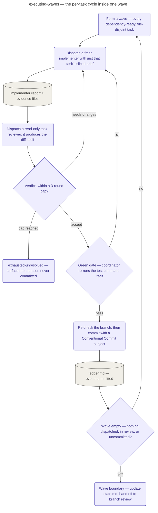

# Executing Waves

The pipeline's Execution stage: dispatches the plan's `## Dispatch Map` wave by wave, taking
each task through a fresh implementer, a read-only reviewer, a deterministic green gate, and a
commit the coordinator makes per task (as it also does in branch review, audit, onboarding,
mechanical sweeps, and the fast path).

At `lean`/`standard` this playbook's own mechanics are self-contained; at `thorough` it loads
**superpowers:subagent-driven-development** (REQUIRED) for brief slicing, file handoffs, and the
review/fix loop, but overrides several of that skill's defaults: devcycle's own
reviewing-the-branch and finish stages replace its final-code-reviewer and
finishing-a-development-branch steps, its progress file is replaced by `.devcycle/ledger.md`, and
implementers never commit — only the coordinator does, at step 7 of the per-task cycle. Before
wave 1, a pre-flight settles branch discipline (the topic branch must exist and be recorded) and
the commit-message convention, and patches any task whose plan-level requirements aren't yet
reflected in its own steps.

A wave is formed from the plan's dependency declarations and file lists: every task whose
dependencies are already committed AND whose files overlap no other candidate or running task
joins the same wave, executed by readiness rather than written order. Each task then runs its own
cycle: the brief is sliced down to exactly what that implementer needs — its id, Files,
Interfaces, Dependencies, evidence class and tail length, quality constraints resolved to
verbatim lines, and matched lessons — and dispatched to a fresh `devcycle:implementer`, never
carrying prior tasks' history. Once its report file is confirmed to exist and carry the fields
its evidence class requires, a read-only `devcycle:task-reviewer` is dispatched to produce the
task's diff itself and return a verdict; a non-zero verdict sends findings back to the
implementer for a fix pass, bounded at three rounds per task, past which the task exits
`exhausted-unresolved` and is surfaced to the user rather than committed as if it had passed.

Acceptance still isn't automatic on a reviewer's approval: the coordinator re-runs the task's own
test command itself (or the repo's documented convention, where there is no suite) and reads the
exit status directly — the green gate — before re-checking the actual git branch against the
recorded one and committing with a Conventional Commit subject. Each commit's ledger entry, and
the moment any task produces rendered changes, together drive two triggers this playbook owns:
closing the wave once nothing in it remains undispatched, in review, or uncommitted, and
generating or updating the on-device checklist the same wave a rendered change lands, never
deferred to the end. At the last wave's boundary, execution updates `.devcycle/state.md` to
`stage: branch-review` and hands off to `reviewing-the-branch.md`.

## How it fits
- Up: [the pipeline](../../pipeline/README.md) — where Execution sits, between Planning and
  Branch review.
- Source: [`playbooks/executing-waves.md`](../../../playbooks/executing-waves.md) — the behavior
  spec this page summarizes.

Playbook-internal — for where Execution sits in the pipeline, see
[docs/pipeline/](../../pipeline/README.md).
