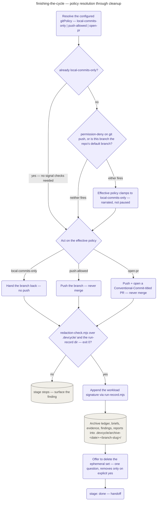

# Finishing the Cycle

The pipeline's last stage, run by both `/devcycle:cycle` and `/devcycle:continue`: resolve the
effective git policy, act on it, then close the state file.

The configured policy resolves from `${user_config.gitPolicy}` — `local-commits-only`
(default), `push-allowed`, or `open-pr` — read once per run; this stage never re-offers the
first-run configuration walkthrough, which belongs to `/devcycle:cycle` alone.
`local-commits-only` is already the floor, so it needs no further checks; for the other two,
the stage checks two signals before pushing anything: a **permission-settings signal** (any
effective Claude Code settings file carries a `deny` rule matching `git push`) and a
**protected-branch signal** (this cycle's branch, from `.devcycle/state.md`, is the repo's
resolved default branch). Either signal firing clamps the **effective policy** to
`local-commits-only` regardless of what was configured — silently, but always narrated in the
handoff's `Git policy:` line.

Acting on the effective policy is the same three-way split as the intent it clamps from:
`local-commits-only` just hands the branch back with its commits; `push-allowed` pushes it and
never merges; `open-pr` pushes and opens a PR whose title parses as a Conventional Commit and
matches this run's derived commit convention, and is likewise never merged. Before the state
file closes, two more gates run: a redaction screen (`redaction-check.mjs`) over the real,
gitignored `.devcycle/` directory and the run-record store — CI's own screen never reaches
either, so this is their only check, and a non-zero exit stops the stage rather than continuing
past an unscreened finding — and a workload-signature append (`run-record.mjs workload`) that
records only counts and enums (request kind, base sha, planned task/wave counts) and never
paths or prose. That append is a final refresh, not the primary collection: the
`hooks/workload-sensor.mjs` commit-sensor already writes the same record progressively on every
commit during the run, and the last-wins join makes this closing write harmless. The stage's
final write to `.devcycle/state.md` sets `stage: done`.

Before offering any cleanup, the stage unconditionally copies this cycle's audit trail —
`ledger.md` plus the `briefs/`, `evidence/`, `findings/`, and `reports/` directories — into
`.devcycle/archive-<date>-<branch-slug>/`, first moving any superseded findings-loop status
files into that same archive. Only then does it offer, in one question, to delete the ephemeral
set that only ever existed to pass content between this cycle's dispatches
(`.devcycle/reports/*`, `.devcycle/evidence/*`, `.devcycle/findings/*`, sweep-argument/report
files, generated per-task briefs); anything short of an explicit yes leaves every file in
place, and the state file, ledger, scope, spec, plan, checklist, and on-device results — plus
anything git-tracked — are never removed regardless of the answer.

## How it fits
- Up: [the pipeline](../../pipeline/README.md) — where finish sits, the pipeline's last stage.
- Source: [`playbooks/finishing-the-cycle.md`](../../../playbooks/finishing-the-cycle.md) — the
  behavior spec this page summarizes.

Playbook-internal — for where finish sits in the pipeline, see
[docs/pipeline/](../../pipeline/README.md).
