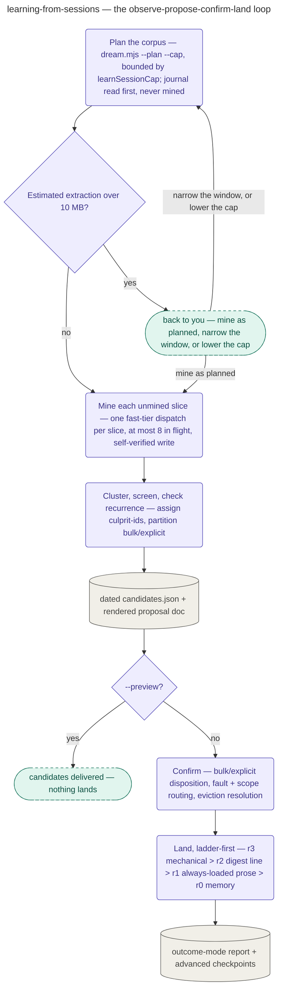

# Learning from Sessions

The standalone command `/devcycle:learn`'s playbook: observe → propose → confirm → land, one
loop mining this repo's sessions and memory for recurring patterns — entered directly, never as
a stage of the guided cycle, and it starts no cycle.

The loop plans its corpus from `dream.mjs --plan --cap`, bounded by the `learnSessionCap` sessions
you configure, rather than walking transcripts directly — so a run's cost follows the sessions it
mines, not every session ever recorded on the machine. The run-record journal is read first and is
never itself mined, so a cold-start repo with no journal falls through to the memory store and
mining rather than reporting nothing found. One number gates dispatch: an estimated extraction over
10 MB comes back to you first. Sessions too large to read at all are skipped by default and are not
counted into that estimate, so they raise no question of their own — the plan's skipped list is named
inside the 10 MB question when it fires, and `--include-oversized` is what mines them. Each unmined
slice the resolved profile admits — the memory store at every profile,
archives/findings/ledgers and user-correction turns at `standard`/`thorough`, raw transcripts at
`thorough` only — gets one fast-tier dispatch, at most 8 of them in flight at a time, that writes
and self-verifies its own observation file, so an interrupted run resumes rather than re-mining. A
single dispatch then reads the full deduped observation store
plus the journal's grouped events, assigns every candidate a stable culprit-id before clustering,
screens for anything sensitive, partitions bulk from explicit candidates, and checks recurrence
(`standard`/`thorough`) against prior promotions. The result is written as one dated candidate
JSON and rendered into a proposal document, advancing the corpus checkpoint — `--preview` stops
here, landing nothing.

A default run instead carries that proposal into **Confirm**: bulk candidates get one reviewed
decision for the whole partition, explicit candidates (sensitive-flagged, and every
contradiction) each need their own `AskUserQuestion`; every candidate is routed by fault
(`repo` vs. `pipeline`, the latter never landing locally) and, for repo-fault candidates, by
scope (`repo-devs` vs. `just-me`); every landing's placement is resolved against the target
section's cap before it can land, with an eviction shown and approved rather than silently
displacing another line. **Land** then applies each adopted candidate at the highest mechanizable
rung — r3 mechanical check, r2 lessons-digest line, r1 always-loaded prose (only with a recorded
justification), or r0 memory — records the promotion, and offers to commit the freshly written
output before re-rendering the report in outcome mode and rewriting the run's own checkpoint.

## How it fits
- Up: [the pipeline](../../pipeline/README.md) — devcycle's guided cycle; `learn` sits outside it
  as a standalone entry point.
- Source: [`playbooks/learning-from-sessions.md`](../../../playbooks/learning-from-sessions.md) —
  the behavior spec this page summarizes.

Playbook-internal — for where learning sits relative to the pipeline, see
[docs/pipeline/](../../pipeline/README.md).
