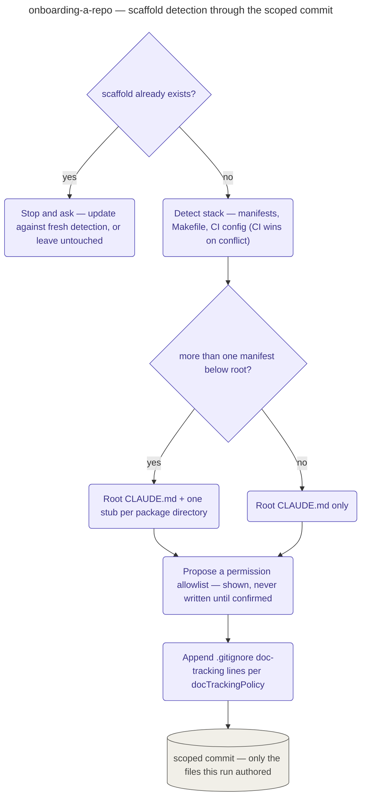

# Onboarding a Repo

The standalone command `/devcycle:onboard`'s playbook: scaffold tier-2 setup for a repo — it is
entered directly, not reached as a stage of the guided cycle, and it starts no cycle.

Before detecting anything it checks for an existing scaffold (a root `CLAUDE.md` with a
`## devcycle onboarding` section, or per-package stubs already naming a stack) and, if found,
hard-stops to ask whether to update it against freshly detected commands — it never overwrites
silently. Detection itself is read, never guessed: manifests (`package.json` scripts,
`pyproject.toml`, `Cargo.toml`/`go.mod`), `Makefile` targets, and CI workflow files, in that
order, with one override — a CI config that already runs a command beats a same-named manifest
script, because CI is what actually gates merges. More than one manifest below root scaffolds
each package directory its own `CLAUDE.md` stub in addition to the root file, and a lockfile
beside a manifest fixes the exact invocation (`npm test` vs. `pnpm test`).

The output is four artifacts: the root (and, in a monorepo, per-package) `CLAUDE.md` holding only
a `## devcycle onboarding` section naming the detected stack and its copy-pasteable test/build/
lint commands; a proposed permission allowlist for `settings.json`, presented in the response for
review and never written until the user confirms it; `.gitignore` lines resolved against
`docTrackingPolicy`, appended without ever touching an existing entry; and a scoped commit of
exactly what this run authored, skipping any path the repo's own ignore rules already cover.

## How it fits
- Up: [the pipeline](../../pipeline/README.md) — devcycle's guided cycle; `onboard` sits outside
  it as a standalone entry point.
- Source: [`playbooks/onboarding-a-repo.md`](../../../playbooks/onboarding-a-repo.md) — the
  behavior spec this page summarizes.

Playbook-internal — for where onboarding sits relative to the pipeline, see
[docs/pipeline/](../../pipeline/README.md).
