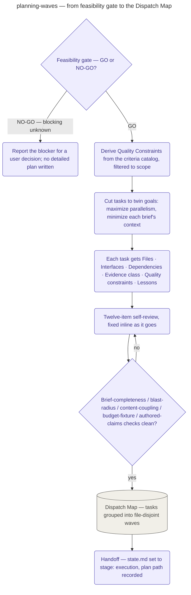

# Planning Waves

The pipeline's Planning stage: turns an approved spec into an implementation plan that doubles
as the execution strategy, ending in either a wave plan or a NO-GO report.

Before any task is written, a feasibility pass verifies every API, module, tool, doc section,
and convention the spec names against the real repo — never assumed — and spikes the riskiest
unknown if a quick spike can settle it. That pass ends in an explicit **GO** or **NO-GO**
verdict: a NO-GO names each blocking unknown in plain language and stops for a user decision
rather than burying the risk inside a detailed plan. Only past GO does planning read the quality
criteria catalog, filtered to the confirmed scope, and emit one `QC<n>` line per applicable
constraint — kept in its own `## Quality Constraints` section, never merged with the spec's
verbatim `## Global Constraints`, so the precedence between "the spec said so" and "the criteria
catalog derived this" stays visible.

Task boundaries are then drawn to two goals held together, not traded off: maximize parallelism
(file-disjoint, dependency-free tracks) and minimize each implementer's context (every brief
self-contained, with exact interfaces pinned so concurrent implementers never need each other's
history). At `lean`/`standard` a self-contained Plan Mechanics section supplies the task
template — `Files`, `Interfaces`, the three per-task declaration lines (`Dependencies` derived
from what's actually consumed, `Evidence` in one of the three classes evidence.md owns, and an
optional `Execution: sweep` marker for one uniform edit rule) — directly; at `thorough` the same
template comes from the `superpowers:writing-plans` sub-skill instead, with two rules this
playbook always keeps regardless: the executor named in the plan header is always
`executing-waves.md`, and no task ever carries a commit step.

Once the plan is drafted, planning runs its own twelve-item self-review — spec coverage,
placeholder scan, type consistency, factual-claim accuracy, no count-only enumeration,
mirrored-file parity, scripted checks (`lint-plan-code-blocks.mjs`,
`brief-completeness-check.mjs`, `blast-radius-check.mjs`, `content-coupling-check.mjs`,
`budget-fixture-check.mjs`, and `authored-claims-check.mjs` as the factual-claim item's
backstop), and a manual assumed-tooling cross-check — fixing what it finds inline, with no
separate re-review pass. `blast-radius-check.mjs` hard-fails on any referencer (test or non-test)
of a task's changed file that sits in no Files block, cleared by adding the file or a `-
Blast-radius override:` line; `content-coupling-check.mjs` flags a same-wave task whose brief
names a file another same-wave task edits, cleared by a dependency or a `- Content-coupling
override:` line. `budget-fixture-check.mjs` hard-fails when a task's Files touch a budgeted
surface (`playbooks/`, `commands/`, `agents/`, `references/` markdown) without also touching the
matching budget fixture, cleared by adding the fixture or a `- Budget-fixture override:` line;
`authored-claims-check.mjs` is a blocking lint flagging an unguarded `path.ext:line` reference or
a bare count claim, cleared by a `(verified: <cmd>)` or `(assumption)` marker. A non-zero exit
from the brief-completeness, blast-radius, content-coupling, budget-fixture, or authored-claims
checks is a hard stop, resolved by fixing the plan or recording an explicit override, never by
handing off around it. `wave-disjointness-check.mjs` runs separately as a pre-handoff gate on the
`## Dispatch Map` — not as a self-review item — joined there by `content-coupling-check.mjs`.

The plan's required final section, the `## Dispatch Map`, groups every task into waves — a wave
holds only dependency-ready, file-disjoint tasks, never two tasks that touch the same file even
if both declare no dependency. That map is what `executing-waves.md` dispatches from. Planning
closes by writing `.devcycle/state.md` (`stage: execution`, the plan path) and emitting the
stage's handoff block; committing the saved plan itself is gated on the repo's doc-tracking
policy and whether the plan's path is git-ignored.

## How it fits
- Up: [the pipeline](../../pipeline/README.md) — where Planning sits, between Brainstorm and
  Execution.
- Source: [`playbooks/planning-waves.md`](../../../playbooks/planning-waves.md) — the behavior
  spec this page summarizes.

Playbook-internal — for where Planning sits in the pipeline, see
[docs/pipeline/](../../pipeline/README.md).
