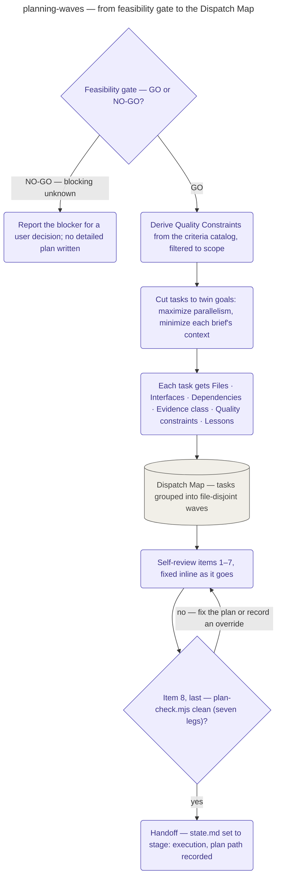

# Planning Waves

The pipeline's Planning stage: turns an approved spec into an implementation plan that doubles
as the execution strategy, ending in either a wave plan or a NO-GO report.

Before any task is written, a feasibility pass verifies every API, module, tool, doc section,
and convention the spec names against the real repo — never assumed — and spikes the riskiest
unknown if a quick spike can settle it. That pass ends in an explicit **GO** or **NO-GO**
verdict: a NO-GO names each blocking unknown in plain language and stops for a user decision
rather than burying the risk inside a detailed plan. Only past GO does planning read the quality
criteria catalog, filtered to the confirmed scope, and emit one `QC<n>` line per applicable
constraint — kept in its own `## Quality Constraints` section, never merged with the spec's
verbatim `## Global Constraints`, so the precedence between "the spec said so" and "the criteria
catalog derived this" stays visible.

Task boundaries are then drawn to two goals held together, not traded off: maximize parallelism
(file-disjoint, dependency-free tracks) and minimize each implementer's context (every brief
self-contained, with exact interfaces pinned so concurrent implementers never need each other's
history). At `lean`/`standard` a self-contained Plan Mechanics section supplies the task
template — `Files`, `Interfaces`, the three per-task declaration lines (`Dependencies` derived
from what's actually consumed, `Evidence` in one of the three classes evidence.md owns, and an
optional `Execution: sweep` marker for one uniform edit rule) — directly; at `thorough` the same
template comes from the `superpowers:writing-plans` sub-skill instead, with two rules this
playbook always keeps regardless: the executor named in the plan header is always
`executing-waves.md`, and no task ever carries a commit step.

Once the plan is drafted, planning runs its own eight-item self-review — spec coverage,
placeholder scan, type consistency, factual-claim accuracy, no count-only enumeration,
mirrored-file parity, a manual assumed-tooling cross-check, and the plan gate last — fixing what
it finds inline, with no separate re-review pass. The plan gate is one command,
`scripts/plan-check.mjs`, running seven legs over the plan: `codeBlocks` (pasted JS/mjs code
blocks parse), `briefCompleteness` (every task carries its required fields and the Dispatch Map
lists every task), `blastRadius` (every referencer of a changed file, test or not, sits in some
Files block), `contentCoupling` (no same-wave task's brief names a file another same-wave task
edits), `budgetFixtures` (a task touching a budgeted surface — `playbooks/`, `commands/`,
`agents/`, `references/` markdown — also touches its budget fixtures and
`docs/decisions/README.md`, whose `budget:` lines `validate.mjs` holds the fixtures to),
`waveDisjointness` (no two same-wave tasks list the same file), and `authoredClaims` (the
factual-claim item's backstop: an unguarded `path.ext:line` reference or bare count claim,
cleared by a `(verified: <cmd>)` or `(assumption)` marker). It fails closed: a plan with no
`## Dispatch Map` is a finding before any leg runs. Three findings clear by an explicit override
line instead of a fix — `- Blast-radius override:`, `- Content-coupling override:`, and
`- Budget-fixture override:`, each with a reason. A non-zero exit is a hard stop, resolved by
fixing the plan or recording an override, never by handing off around it. On success the gate
prints one ok line, with each leg's notes (such as cleared overrides) reduced to a count unless
`--verbose` lists them; a failing run always lists them. A run in progress records a `gate-ran`
event with its result.

The plan's required final section, the `## Dispatch Map`, groups every task into waves — a wave
holds only dependency-ready, file-disjoint tasks, never two tasks that touch the same file even
if both declare no dependency. That map is what `executing-waves.md` dispatches from. Planning
closes by writing `.devcycle/state.md` (`stage: execution`, the plan path) and emitting the
stage's handoff block; committing the saved plan itself is gated on the repo's doc-tracking
policy and whether the plan's path is git-ignored.

## How it fits
- Up: [the pipeline](../../pipeline/README.md) — where Planning sits, between Brainstorm and
  Execution.
- Source: [`playbooks/planning-waves.md`](../../../playbooks/planning-waves.md) — the behavior
  spec this page summarizes.

```mermaid
---
title: planning-waves — from feasibility gate to the Dispatch Map
accDescr: Playbook-internal flowchart of the planning stage, from the feasibility gate's GO/NO-GO verdict through quality-constraint derivation, task cutting to the twin goals of parallelism and minimal context, the Dispatch Map, the eight-item self-review ending in the plan gate, and the handoff to execution.
---
flowchart TD
    FEAS{"Feasibility gate — GO or NO-GO?"}:::stage
    FEAS -->|"NO-GO — blocking unknown"| REPORT("Report the blocker for a user decision; no detailed plan written"):::stage
    FEAS -->|GO| QC("Derive Quality Constraints from the criteria catalog, filtered to scope"):::stage
    QC --> CUT("Cut tasks to twin goals: maximize parallelism, minimize each brief's context"):::stage
    CUT --> TASK("Each task gets Files · Interfaces · Dependencies · Evidence class · Quality constraints · Lessons"):::stage
    TASK --> MAP[("Dispatch Map — tasks grouped into file-disjoint waves")]:::structural
    MAP --> SELFREVIEW("Self-review items 1–7, fixed inline as it goes"):::stage
    SELFREVIEW --> GATE{"Item 8, last — plan-check.mjs clean (seven legs)?"}:::stage
    GATE -->|"no — fix the plan or record an override"| SELFREVIEW
    GATE -->|yes| HANDOFF("Handoff — state.md set to stage: execution, plan path recorded"):::stage

    classDef stage fill:#EEEDFE,stroke:#534AB7,color:#3C3489;
    classDef tool fill:#E1F5EE,stroke:#0F6E56,color:#085041,stroke-dasharray:5 5;
    classDef structural fill:#F1EFE8,stroke:#5F5E5A,color:#444441;
```

Playbook-internal — for where Planning sits in the pipeline, see
[docs/pipeline/](../../pipeline/README.md).
