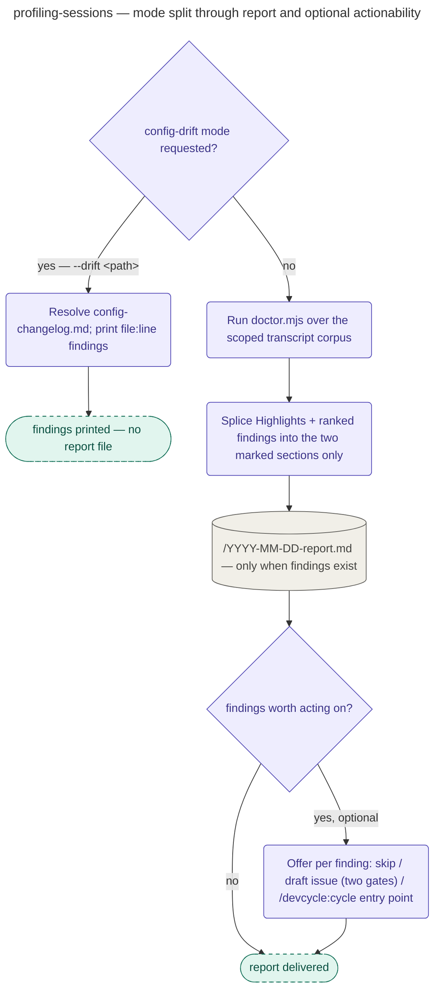

# Profiling Sessions

The standalone command `/devcycle:doctor`'s playbook: profile session cost, context depth, and
model routing, then rank what to fix — entered directly, never as a stage of the guided cycle,
and it starts no cycle.

The playbook never walks transcripts itself; it runs `scripts/doctor.mjs` and reads the finished
report it prints, filling in exactly two marked sections — Highlights and the ranked findings —
and changing nothing else in the rendered document. With no flags the script scans every
transcript under `~/.claude/projects` carrying a `devcycle:`-prefixed attribution id; `--all`
widens that to every transcript, tagged or not; `--since`/`--until` narrow the measurement window
within each kept session. A separate `--drift <path>` mode takes precedence over all of that: it
skips cost analysis entirely and flags stale `userConfig` references in a target file against
`references/config-changelog.md`.

Interpretation, not transcription, is the playbook's real job: it leads from the report's
workload-adjusted, matched-cohort `## At a glance` figures as the headline, treats the full
historical corpus as supporting evidence, and assigns severity and dollar-impact rank to the
script's unranked candidate lines using the shared findings vocabulary. It also renders the
`## Previously promoted — did it hold` section's verdicts (`held`/`recurred`/`errored`/
`unmeasurable`/`broken`) straight from the run-record journal via the verification engine, never
by re-running the mining loop, and every run with at least one finding persists to
"YYYY-MM-DD-report.md" in the fixed doctor directory — resolved via "node -e \"import('${CLAUDE_PLUGIN_ROOT}/scripts/doctor.mjs').then(m=>console.log(m.doctorDir()))\"" (DEVCYCLE_DOCTOR_DIR if set, else "~/.claude/devcycle/doctor"). An optional, fully skippable actionability step can draft
a GitHub issue (screened, then gated by two separate confirmations before anything is filed) or
hand back a `/devcycle:cycle` entry-point string — the playbook itself never starts one.

## How it fits
- Up: [the pipeline](../../pipeline/README.md) — devcycle's guided cycle; `doctor` sits outside
  it as a standalone entry point.
- Source: [`playbooks/profiling-sessions.md`](../../../playbooks/profiling-sessions.md) — the
  behavior spec this page summarizes.

Playbook-internal — for where profiling sits relative to the pipeline, see
[docs/pipeline/](../../pipeline/README.md).
