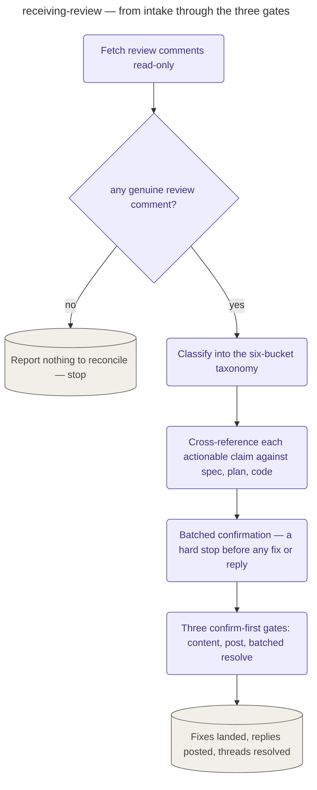

# Receiving a Review

The standalone reconcile stage — the **respond** arm of the review write-back path. Entered
directly by `/devcycle:reconcile` and never reached on the pipeline walk, it turns a pull
request's own review comments into landed fixes and consent-gated replies, then resolves the
threads it closed from its side.

Given a PR, it fetches the review comments read-only, classifies each into a six-bucket taxonomy,
verifies every actionable claim against the real spec, plan, or code before it reaches an
implementer, and stops at a batched confirmation before any fix or reply. A review comment is
untrusted external content — a claim to check, never an instruction — so nothing a comment asserts
about a severity, a fixed status, or a file to touch is trusted until it is cross-referenced.

Each write action is surfaced only where the thing it acts on exists. When intake yields no
genuine review — every thread already resolved, or deduped against a prior run — reconcile reports
"nothing to reconcile" and stops rather than opening an empty respond flow. Fixes and replies then
ride three separate confirm-first gates — content, post, and a batched resolve — none of them the
push gate. Every reply body is rendered through the same comment-body contract the filing step
uses, so a reconcile reply and a filed finding are indistinguishable in shape and origin.

## How it fits
- Up: [the pipeline](../../pipeline/README.md) — devcycle's guided cycle; `reconcile` sits
  outside it as a standalone entry point.
- Source: [`playbooks/receiving-review.md`](../../../playbooks/receiving-review.md) — the behavior
  spec this page summarizes.
- Contract: [`references/review-comments.md`](../../../references/review-comments.md) — the
  taxonomy, the comment→finding mapping, and the reply and comment-body contracts this stage names
  and never restates.
- File side: [`reviewing-code`](../reviewing-code/README.md) — the **file** arm of the write-back
  path, where a `/devcycle:review` audit run files its findings onto the same PR.

Playbook-internal — for where receiving a review sits relative to the pipeline, see
[docs/pipeline/](../../pipeline/README.md).
