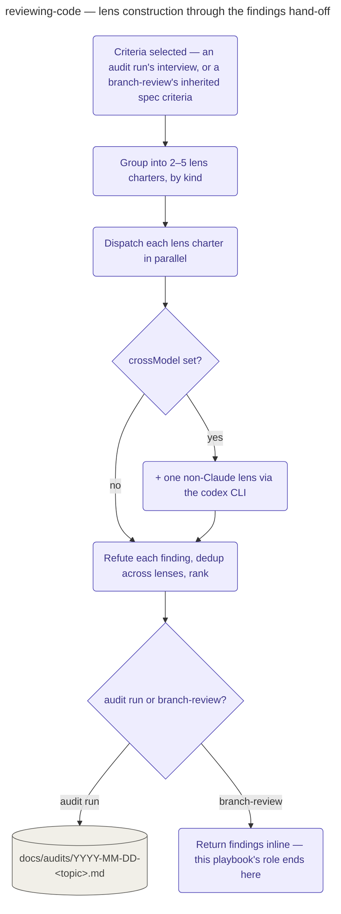

# Reviewing Code

The shared review engine: the pipeline's Audit stage, standalone `/devcycle:review`, and
`maintaining-the-repo` (which wraps it for `/devcycle:maintain`'s fold-in reviews) all dispatch
into it as **audit runs**; the branch-review stage below is a fourth, in-cycle caller that skips
its interview and document.

Given a scope (`branch`, `repo`, or `files`) and a set of criteria, this engine answers one
question: what is wrong with this code? Which caller invoked it decides more than the scope
does. An audit run — `/devcycle:review` standalone, the pipeline's Audit stage, or
`maintaining-the-repo` — runs a criteria interview first (never assuming criteria; drafted from
a repo-convention and stack-detection discovery pass, then confirmed with you) and ends by
writing a ranked findings document. The branch-review stage instead inherits the cycle's spec
criteria, skips the interview, and takes its findings back inline rather than writing a
document.

Internally, the confirmed criteria are grouped into **2–5 lens charters by kind, not by
count** — related criteria share a charter so each reviewer holds something it can actually
hold, and a lens is never one criterion wide. `reviewDepth` then picks the engine: `panel`
dispatches every charter through `workflows/review-panel.js` as one JSON argument (`scope`,
`specPath`, a `lenses` array of `{key, charter}` objects, and a `crossModel` flag that adds a
non-Claude lens via the `codex` CLI); `single` runs the same charters as inline read-only
reviewers instead — a complete review in its own right, not a degraded panel. A non-zero or
missing `review-panel.js` degrades to `single`, disclosed verbatim in the engine line rather
than silently substituted. Every finding is then adversarially refuted by a second reader,
deduplicated across lenses, and ranked before anything is reported.

Reviewers work from fresh context — the scope, criteria, and spec path only, never the
authoring conversation — and never write the tree they're reviewing (formatters and linters run
check-mode only). Only an audit run takes the final step: writing
`docs/audits/YYYY-MM-DD-<topic>.md`, complete with a coverage statement and a provenance header,
then committing it scoped to that one path. A branch-review run returns findings and an engine
line and stops there — the rounds-and-cap loop, the ledger cross-check, and the handoff belong
to that stage, not this one.

## How it fits
- Up: [the pipeline](../../pipeline/README.md) — where the Audit stage sits.
- Source: [`playbooks/reviewing-code.md`](../../../playbooks/reviewing-code.md) — the behavior
  spec this page summarizes.
- Other callers: [`playbooks/maintaining-the-repo.md`](../../../playbooks/maintaining-the-repo.md)
  wraps this engine for `/devcycle:maintain`; standalone
  [`commands/review.md`](../../../commands/review.md) runs it directly, outside any cycle.

Playbook-internal — for where Audit sits in the pipeline, see
[docs/pipeline/](../../pipeline/README.md).
