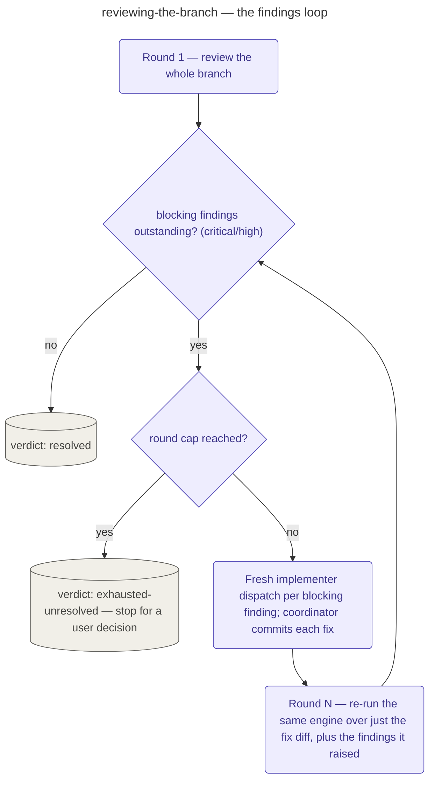

# Reviewing the Branch

The pipeline's branch-review stage: the gate between execution and finishing, one review of
everything the branch does against the spec that ordered it, before on-device verification.

This stage takes just three inputs from the execution handoff — the branch, the spec path, and
the ledger path — and delegates engine choice in full to `reviewing-code` (below): which of
`panel` or `single` runs, how an oversize diff is chunked, and the `panel→single` degradation
are all that engine's rules, restated nowhere here. What this stage owns instead is its own
**spec-compliance layer** (every requirement the spec states is checked against the whole
branch, not just the diff, and the ledger is cross-checked so every committed task is on the
branch and nothing on the branch lacks a ledger trail) and its **findings loop**: round 1
reviews the whole branch; only `critical`/`high` findings are blocking and re-open the loop;
each blocking finding goes to a fresh implementer dispatch the coordinator commits before a
narrow re-review of just that fix; and the loop is bounded by a per-cycle round cap tracked
through `.devcycle/ledger.md`'s `review-round` events. The cap bounds effort, never truth — it
never converts an outstanding blocking finding into a pass.

The stage ends in exactly one of two verdicts: `resolved` (no blocking findings outstanding;
any residue is carried over as non-blocking) or `exhausted-unresolved` at the cap (the stage
stops and reports the outstanding findings for a user decision, never proceeding to on-device or
finishing).

## How it fits
- Up: [the pipeline](../../pipeline/README.md) — where branch review sits, between execution and
  on-device verification.
- Source: [`playbooks/reviewing-the-branch.md`](../../../playbooks/reviewing-the-branch.md) — the
  behavior spec this page summarizes.
- Engine: [`reviewing-code`](../reviewing-code/README.md) — the shared engine this stage
  delegates engine selection and dispatch to.

Playbook-internal — for where branch review sits in the pipeline, see
[docs/pipeline/](../../pipeline/README.md).
