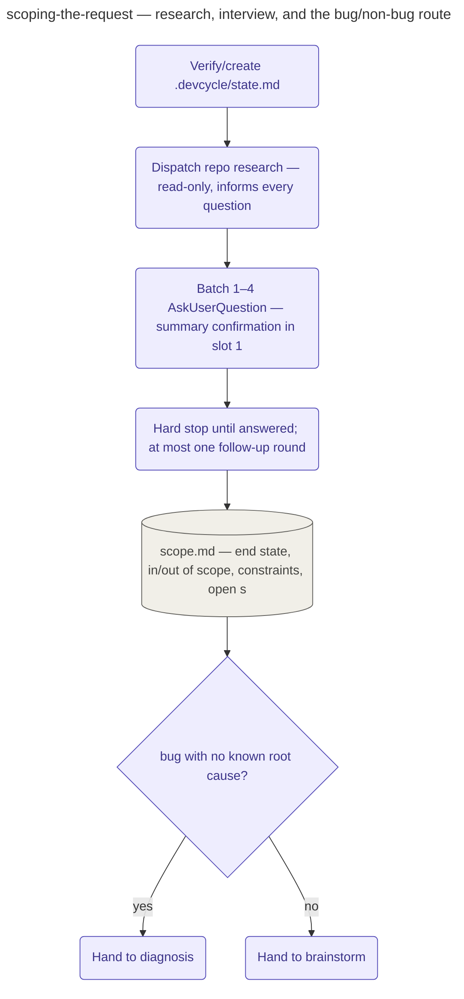

# Scoping the Request

The pipeline's pre-stage for a rough-idea request — triage's `"rough idea"` branch lands here,
in front of `superpowers:brainstorming` or, for a bug whose root cause isn't known yet, in front
of the diagnosis stage — and its only job is settling *what is being asked*, never designing the
fix.

The stage opens by verifying `.devcycle/state.md` exists at the repo's toplevel, creating it as
a backstop if the pipeline's own step 0 didn't. From there it runs **research before
questions**: a dispatched repo-research pass (graph-first, falling back to search) establishes
what the change actually touches — components, affected files, other occurrences of the same
pattern — because that is the repo's job, not the user's; the user is asked only for intent,
desired outcomes, and priorities, never for something the repo can already answer. Bug requests
interview differently: the questions target the symptom (reproduction steps, expected vs.
actual, frequency, environment, logs), never the root cause or the fix shape, since establishing
those belongs to the diagnosis stage and the user, respectively.

Every question goes through AskUserQuestion in batches of 1–4 with concrete options plus Other,
never trickled one at a time; the first batch's slot 1 is always the one-paragraph summary
confirmation. The stage then hard-stops — no drafting, no assumed answers — until the batch is
answered, allows at most one follow-up round, and turns every remaining unknown into an explicit
`<tbd>` marker in the scope summary rather than silently defaulting it. Small, reversible
implementation choices are the one exemption from the interview discipline.

The stage ends by writing `.devcycle/scope.md` (end state, in/out of scope, affected areas,
constraints, open `<tbd>`s) and naming the next stage explicitly: a bug with no established root
cause routes to `superpowers:systematic-debugging` (the pipeline's diagnosis stage) with the
Reproduction section as its starting evidence; everything else routes to
`superpowers:brainstorming` with the scope summary as its explored context. An audit-shaped
request never reaches this stage at all — triage sends it straight to the audit stage instead.

## How it fits
- Up: [the pipeline](../../pipeline/README.md) — where this stage sits (triage's "rough idea"
  branch, ahead of diagnosis or brainstorm).
- Source: [`playbooks/scoping-the-request.md`](../../../playbooks/scoping-the-request.md) — the
  behavior spec this page summarizes.

Playbook-internal — for where this sits in the pipeline, see
[docs/pipeline/](../../pipeline/README.md).
</content>
