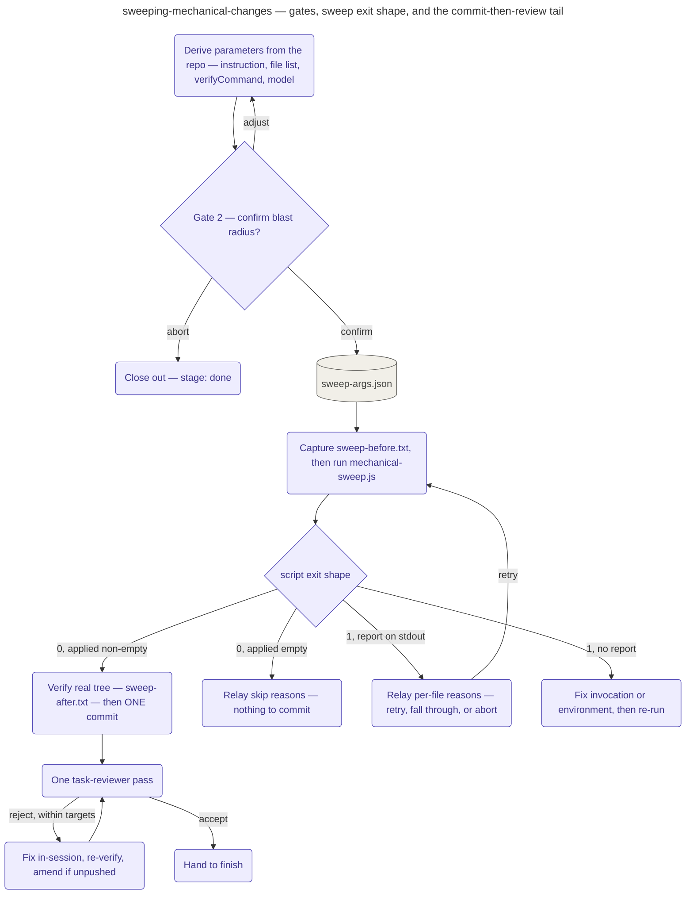

# Sweeping Mechanical Changes

Triage's short in-session alternative for a bulk-mechanical request — one uniform edit rule
applied identically across many files, success checkable by a single command — entered only
after triage has judged the request that way and the user has confirmed via the AskUserQuestion
gate; this playbook never re-litigates that verdict, it only executes what it already implies.

Instead of the full pipeline it runs one supervised pass: derive the sweep parameters from the
repo — never from memory — confirm the exact blast radius, run
`workflows/mechanical-sweep.js` (pilot-first, per-file verify, worktree isolation), commit once,
one reviewer pass, hand to finish. Subagent implementers, the plan file, and the wave ledger are
dropped; nothing else is. **Deriving parameters** means the request's edit rule verbatim as the
instruction; a file list found by search, with the exact `grep`/`rg` derivation command recorded
alongside it; the `verifyCommand` taken from the repo's own documented verification convention
(the script hard-requires one); the model resolved from the `implementerModel` knob onto
`DEVCYCLE_SWEEP_MODEL`, since a sweep edit is single-file mechanical, the fast tier's ideal case;
and a clean-targets check — every target must be both tracked and clean — that stops for a user
decision on any target that fails it.

**Gate 2** writes the derived parameters to `.devcycle/sweep-plan.md` and asks exactly ONE
AskUserQuestion presenting that blast radius (confirm / adjust / abort); on confirm, the
parameters are written to `.devcycle/sweep-args.json` and nothing has touched the tree yet. The
baseline verify run is captured to `sweep-before.txt` in the real working tree — the only moment
it can be, since the script starts copying files back as it runs — before the script is invoked.
Its exit shape then branches three ways: exit 0 saves the stdout report to
`sweep-report.json` and, if anything was actually applied, moves to verify-and-commit (an empty
`applied` list means nothing to commit, and the per-file skip reasons are relayed instead); exit
1 with a stdout report is a pilot or baseline hard stop, relayed verbatim for a user decision
(retry / fall through to the normal pipeline / abort); exit 1 with no report is a broken
invocation or environment, quoted from stderr and fixed rather than treated as a verification
verdict. Before any re-run over targets already carrying this sweep's edits, the **re-run rule**
reverts those edits first, since a non-idempotent instruction applied twice would ride into the
commit doubled.

Once the sweep's changes verify green in the real tree (`sweep-after.txt`), the whole sweep lands
as ONE Conventional Commit scoped to the confirmed target files, with the resulting sha recorded
on `.devcycle/state.md`'s `sweepCommit:` line immediately. **Light review** dispatches exactly
one `devcycle:task-reviewer` with the diff, both evidence files, and the sweep report; a fix
stays within the confirmed target files (anything wider exceeds the sweep's mechanical scope and
stops for a user decision) and folds into the sweep commit via `--amend` — but only while that
commit is confirmed not yet pushed to any remote, since amending rewrites history. The evidence
class is `green-green` by construction, since a sweep is defined as behavior-preserving.

## How it fits
- Up: [the pipeline](../../pipeline/README.md) — triage's "bulk mechanical, after two gates"
  branch, the short-path alternative to full-pipeline execution.
- Source: [`playbooks/sweeping-mechanical-changes.md`](../../../playbooks/sweeping-mechanical-changes.md)
  — the behavior spec this page summarizes.

Playbook-internal — for where this sits in the pipeline, see
[docs/pipeline/](../../pipeline/README.md).
</content>
