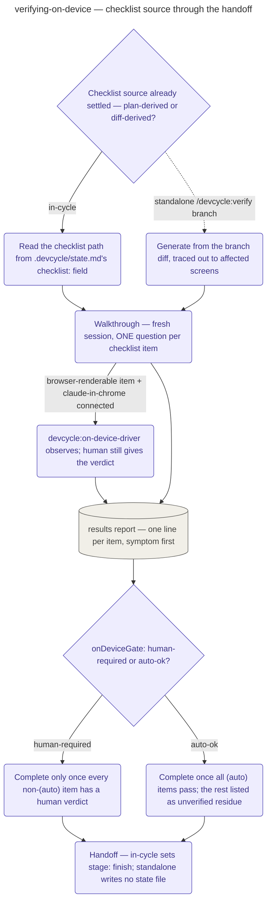

# Verifying On-Device

The pipeline's on-device verification stage, and the engine behind standalone
`/devcycle:verify <branch>`: rendered outcomes have no proving command, so a human walking the
running app is the verification, one checklist item at a time.

Which checklist source applies is settled before the walkthrough begins, and everything after
is identical either way. In-cycle, `executing-waves.md` already generated the checklist during
execution; this stage just reads its path from `.devcycle/state.md`'s `checklist:` field.
Standalone (`/devcycle:verify <branch>`), no checklist exists yet, so this stage derives one
from the branch itself, automatically and without a confirmation step: it resolves the branch's
base and changed files, traces routes, navigation, and component usage outward from them until
an iteration pulls in no new surface, and writes checklist items against those affected
surfaces rather than against the changed files themselves. If tracing turns up no rendered
surface at all, the stage writes no checklist and reports itself not applicable.

The walkthrough itself runs in a fresh session carrying only the checklist path and the branch.
Its interview rule is a deliberate exception to devcycle's usual batched interviews: ONE
question per checklist item, never batched, each telling the human exactly where to look and
waiting for a verdict before moving on — batching here measurably drops findings quality. When
an item renders as a page and claude-in-chrome is connected, the coordinator dispatches
`devcycle:on-device-driver` to observe it rather than observing it itself; the human still
gives every verdict. The walkthrough ends with a results report, one line per item, symptom
first: passed with what was seen, or FAILED with what appeared instead and a severity.

Closing the stage depends on the resolved `onDeviceGate`: `human-required` needs a human
verdict on every non-`(auto)` item; `auto-ok` lets it close once every structurally verifiable
item is `(auto)`-checked, leaving the rest as unverified residue in the handoff — a relaxed
closing condition, never a relaxed reporting one. The handoff then differs by path only in its
state: in-cycle, it sets `.devcycle/state.md`'s `stage: finish` field so the run resumes there;
standalone, it writes no state file at all, since an existing one belongs to someone else's
in-flight cycle.

## How it fits
- Up: [the pipeline](../../pipeline/README.md) — where on-device verification sits, between
  branch review and finish.
- Source: [`playbooks/verifying-on-device.md`](../../../playbooks/verifying-on-device.md) — the
  behavior spec this page summarizes.
- Standalone: [`commands/verify.md`](../../../commands/verify.md) — runs this stage directly,
  outside any cycle, from a branch's diff instead of a plan.

Playbook-internal — for where this sits in the pipeline, see
[docs/pipeline/](../../pipeline/README.md).
